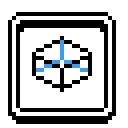
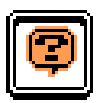
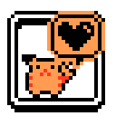
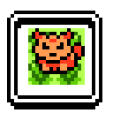
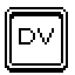
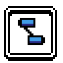
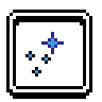
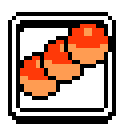
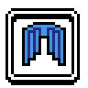

# pokerecomp mods

Mods for [pokerecomp](https://github.com/Decryptu/pokerecomp), the Pokemon Gold,
Silver and Crystal recompilation. Each mod is GDScript under `mods/<id>/` and
installs as a `.zip` on every platform the game runs on.

## The mods

| | Mod | Version | What it does |
| --- | --- | --- | --- |
|  | [`voxel3d`](mods/voxel3d/) | 0.6.9 | Draws the overworld in 3D, built from the cartridge's own tiles. Sky colours follow the clock, water is animated, and you can move the camera. Battles happen on the map you were standing on. Menus stay 2D and pixel-perfect. |
|  | [`randomizer`](mods/randomizer/) | 0.3.1 | Randomizes a playthrough from a four-digit seed: wild Pokemon, gifts, starters, trades, items, badges, shops, stats, types, movesets and trainer teams. The seed is saved with the game, and the mod checks that key items and badges stay reachable. |
|  | [`follower`](mods/follower/) | 0.3.3 | One of your Pokemon walks behind you. Pick which one from its party menu, choose whether it stays out on a bike or on water, and put it away with one key. Face it and press A to pet it. It can also pick up hidden items. |
|  | [`overworld_encounters`](mods/overworld_encounters/) | 0.4.1 | Wild Pokemon walk around on the map instead of appearing during random steps. Up to sixteen per map, taken from that map's own encounter table. Each leaves after half a minute and another takes its place, so a route keeps rolling. Shinies never leave, and Pokemon with very high DVs glow gold. |
|  | [`hidden_stats`](mods/hidden_stats/) | 0.1.1 | Adds a fourth page to a Pokemon's stats screen showing its DVs and its stat experience. |
|  | [`linking_cord`](mods/linking_cord/) | 0.1.1 | An item that evolves trade-only Pokemon without trading. Sold on the second floor of Goldenrod Dept Store. |
|  | [`quality_of_life`](mods/quality_of_life/) | 0.1.3 | Seven conveniences, each with its own switch and all off by default: field moves without a Pokemon that knows them, Repel renewal, EXP from catches, PC in the start menu, type effectiveness hints, stat stages and a weather indicator. |
|  | [`shiny_charm`](mods/shiny_charm/) | 0.1.1 | Complete the Pokedex, get your diploma from the GAME designer in Celadon, and he hands you a Shiny Charm. While it is in your bag, wild Pokemon are three times more likely to be shiny. |
|  | [`catch_combo`](mods/catch_combo/) | 0.1.0 | Catch the same species over and over and its wild Pokemon are drawn with more DV words, so a shiny comes sooner. The Let's Go games' Catch Combo, on the rungs they use, counting a catch from grass, water, a rod, a tree or a rock. A box after each catch says how long the combo is now. |
|  | [`achievements`](mods/achievements/) | 0.1.0 | Thirty achievements: one for each of the sixteen badges, and fourteen more for the Pokedex, a shiny, a level 100 and the rest of what a run is remembered by. A banner over the map says which one you just got, drawn the way the game names a town you walk into, and a page in the start menu says which are left. Install it on a save you have already played and it reads what that save has and awards all of it under one line. |

## Installing

Two routes, both ending in the same installer.

**Follow this index.** In the game's launcher, on its mods page, add:

```
Decryptu/pokerecomp-decrypt-mods
```

The launcher turns that into the feed itself, which you can paste instead:

```
https://decryptu.github.io/pokerecomp-decrypt-mods/index.json
```

Either one lists everything above; picking a mod downloads and installs it.
Uninstalling a mod from an index leaves its row behind so you can reinstall it
in one press.

**Or install a `.zip` by hand.** Take an archive from
[Releases](https://github.com/Decryptu/pokerecomp-decrypt-mods/releases) and use
**Install** on the same page, or drop it on the window where the OS allows that.
A mod installed this way belongs to no index, so the launcher files it under
"Installed from a file" and removing it deletes it.

Following an index means trusting whoever publishes it, so the game follows none
until you add one. Nothing here asks for a permission a hand-picked `.zip` would
not.

## Building an archive

An archive holds one mod, at its root or in a single folder, and its manifest id
has to match the one the index advertised:

```sh
sh tools/package.sh voxel3d
```

The result lands in `dist/`, with `icon.png` and `thumbnail.webp` inside it if
the mod has them.

## Developing

See [`docs/CONTRIBUTING.md`](docs/CONTRIBUTING.md) for the local loop and for
what a mod is allowed to touch.

## License

MIT, in [`LICENSE`](LICENSE). No cartridge data, artwork or audio is included in
this repository or in any mod it publishes. Geometry, colour and text all come
from what the host game decoded from the player's own cartridge.
